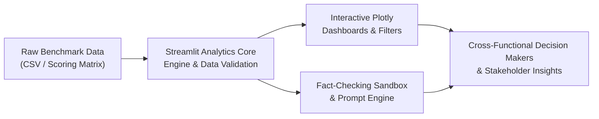

# AI Task Automation & Evaluation Dashboard

[](https://www.python.org/)
[](https://streamlit.io/)
[](https://plotly.com/)
[](https://opensource.org/licenses/MIT)

An interactive analytics web application that evaluates task automation feasibility, benchmarks agent architectures (ReAct, RAG, Code Interpreter), and performs technical fact-checking on instructional prompts.

Built to simplify complex AI and automation concepts into structured, presentation-ready educational materials.

---

## 📌 Key Features

- **Interactive Feasibility Analytics**: Dynamic scatter plots and distribution breakdowns evaluating human effort vs. AI feasibility across Software Engineering, Data Science, and Operations roles.
- **Agent Architecture Mapping**: Categorizes tasks by automation tier (Full, High, Human-in-the-Loop) and suggests optimal multi-step autonomous workflows.
- **Instructional Fact-Checking Sandbox**: Inspects structured prompt templates and validates generated educational outputs (syllabi, code refactoring) against technical correctness guidelines.
- **Presentation-Ready Insights**: Designed for cross-functional communication between technical mentors and non-technical stakeholders.

---

## 🏗️ Architecture & Methodology



1. **Scoring Logic**: AI Feasibility scores are derived from task structuredness, context window requirements, and hallucination tolerance.
2. **Pedagogical Structuring**: Transforms raw metrics into digestible learning modules conforming to Bloom's taxonomy.

---

## 🚀 Quick Start Guide

### Prerequisites
- Python 3.9 or higher
- Git

### Installation

1. **Clone the repository:**
   ```bash
   git clone [https://github.com/tranthingocvy805811-cell/ai-task-automation-dashboard.git](https://github.com/tranthingocvy805811-cell/ai-task-automation-dashboard.git)
   cd ai-task-automation-dashboard
   ```

2. **Create and activate a virtual environment (optional but recommended):**
   ```bash
   # On macOS/Linux:
   python3 -m venv venv
   source venv/bin/activate

   # On Windows:
   python -m venv venv
   venv\Scripts\activate
   ```

3. **Install required dependencies:**
   ```bash
   pip install -r requirements.txt
   ```

4. **Launch the Streamlit web application:**
   ```bash
   streamlit run app.py
   ```
   The application will automatically open in your default browser at `http://localhost:8501`.

---

## 📂 Project Structure

```
ai-task-automation-dashboard/
├── app.py                     # Main interactive Streamlit application
├── requirements.txt           # Python dependencies
├── data/
│   └── tasks_benchmark.csv    # Evaluated task metrics and agent mapping dataset
└── docs/
    └── prompt_evaluation_sop.md # SOP guide for technical fact-checking
```

---

## 🧪 Technical Fact-Checking Standard Operating Procedure (SOP)

When reviewing AI-generated learning materials in the Academy sandbox:
- **Reproducibility**: Sample code must execute end-to-end without hidden local environment dependencies.
- **Fact-Checking**: Validate parameter names, API endpoints, and technical terms against authoritative official documentation.
- **Accessibility**: Provide clear analogies and explanations suitable for diverse learner backgrounds.

---

## 👩‍💻 Author
- **Tran Thi Ngoc Vy**  
  Management Information Systems (Data Science in Business) — Ho Chi Minh University of Banking (HUB)  
  GitHub: [@tranthingocvy805811-cell](https://github.com/tranthingocvy805811-cell)
